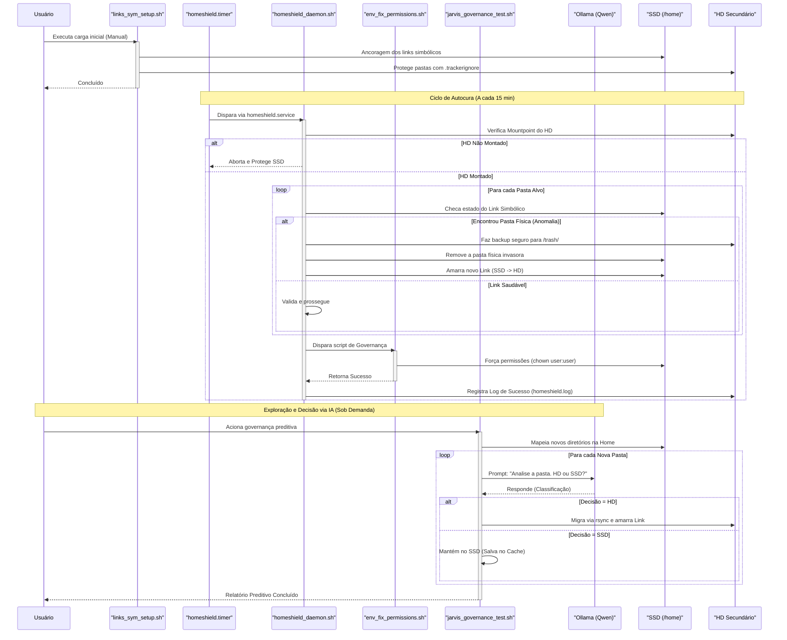

# 🛠️ OS-SHIELD (Antigravity HomeShield)

[](https://opensource.org/licenses/MIT)
[](https://www.gnu.org/software/bash/)

O **OS-SHIELD** é um canivete suíço de infraestrutura local projetado para manter a sua `/home` ultra-leve, estendendo a vida útil e economizando espaço precioso do seu SSD principal (NVMe). Ele cria uma malha logística de links simbólicos e um Daemon resiliente do Systemd que gerencia o fluxo de dados em background para um HD secundário de forma transparente.

Ideal para System Architects, Desenvolvedores Full-Stack e usuários Linux que lidam com caches massivos de desenvolvimento (`node_modules`, Android SDKs, caches de IA locais) em máquinas com armazenamento SSD limitado.

---

## 🏗️ Arquitetura do Sistema

O projeto intercepta e isola pastas de alta taxa de escrita do SSD, movendo os blocos brutos para o HD mecânico e ancorando links lógicos na Home.



* **Modo Atômico**: Proteção contra perda de dados. Se uma pasta física ressurgir na Home, o sistema faz o pivô seguro enviando os resíduos para uma lixeira controlada (`/trash/`) antes de amarrar o link.
* **Resiliência de Daemon**: Um par de serviços do Systemd (`.service` + `.timer`) roda de forma silenciosa a cada 15 minutos para garantir que a sua Home nunca seja corrompida por atualizações do sistema ou resets de snapshots (como Timeshift).


---

## 📁 Estrutura de Diretórios do Repositório

```text
.
├── configs/          # Configurações globais e fstab centralizados
├── daemon_state/     # Unidades de serviço do Systemd (Instalação local)
├── docs/             # Manifesto de IA (AGENTS.md) e runbooks de engenharia
└── scripts/          # Motores Bash modulares e utilitários de cura
```

## 🚀 Instalação e Instanciação Rápida

### 1. Clonar o Repositório
Clone esta caixa de ferramentas dentro da partição do seu HD secundário montado:

```bash
cd /mnt/seu_hd_secundario
git clone https://github.com/seu-usuario/os-shield.git toolbox
cd toolbox
```

### 2. Configurar Variáveis de Ambiente
Abra o arquivo de propriedades e ajuste os caminhos para bater com o seu usuário e ponto de montagem do HD:

```bash
nano configs/shield.conf
```

### 3. Executar o Instalador Gráfico (Wizard)
O novo OS-SHIELD v4 possui um instalador inteligente. Ele configurará o agendamento no seu *User Space* (sem precisar de sudo), definirá o alias global e fará o primeiro backup de segurança:

```bash
./install.sh
```

A partir desse momento, basta digitar `os-shield` em qualquer terminal para abrir a **Central de Controle Zenity**.

## 🛡️ Funcionalidades Avançadas (Painel de Controle)
Digitando `os-shield`, você tem acesso às seguintes ferramentas nativas:
- **Gestão de Whitelist:** Adicione ou remova pastas do SSD através de uma interface interativa (CRUD Completo).
- **Few-Shot Learning (IA):** "Ensine" o modelo de IA sobre suas preferências através de um editor de texto injetado diretamente no prompt, sem precisar de *fine-tuning*.
- **Snapshots de Resiliência:** Execute backups ultra-rápidos e estruturais da sua Home via Rsync ignorando links pesados, mantendo sempre uma cópia salva na lixeira segura.

## 🤖 AI-Agent Readiness (Manifesto de Cooperação)
Se você é um Agente de IA (Cursor, Jarvis, Claude, ChatGPT) operando ou estendendo esta toolbox, você deve ler rigorosamente as instruções contidas em docs/AGENTS.md antes de sugerir ou commitar códigos neste repositório.

## 🩺 Verificação de Saúde do Sistema

Para garantir que a infraestrutura de governança e o daemon estão rodando corretamente, você pode consultar o status do agendador e os logs de auditoria:

Verificar o Agendamento (Systemd Timer do Usuário):

```bash
systemctl --user status homeshield.timer
```

Ler os Logs de Auditoria do Daemon:

```bash
cat /mnt/hd_novo/toolbox/logs/homeshield.log
```

## 📄 Licença
Distribuído sob a licença MIT. Veja LICENSE para mais detalhes.
