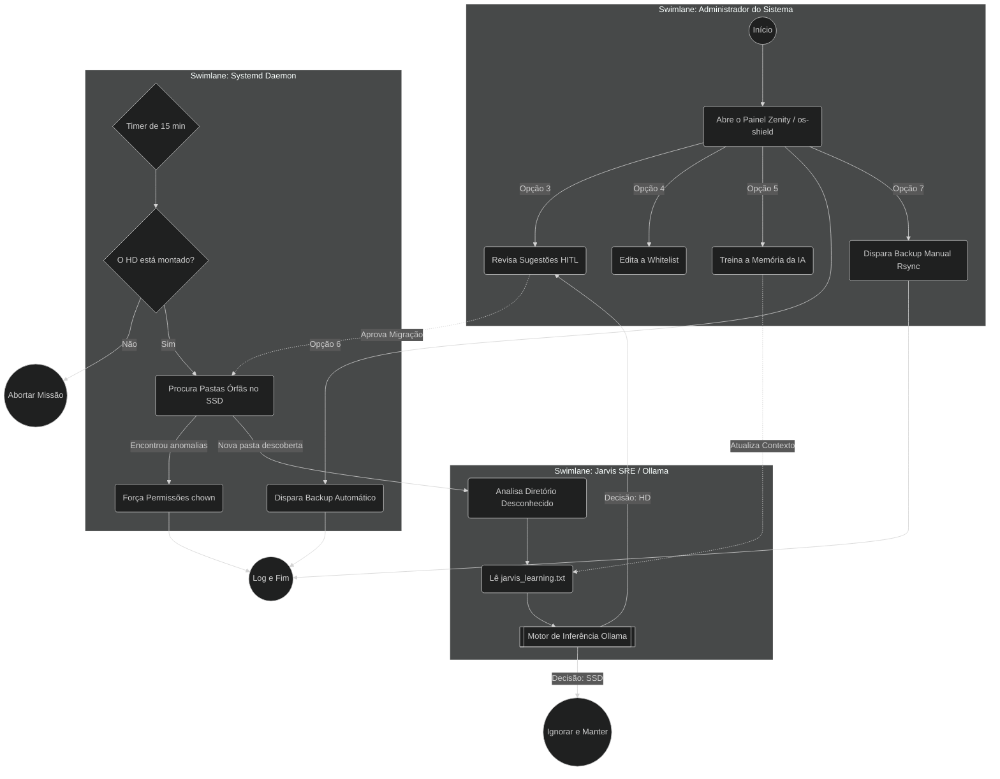

# Arquitetura Operacional do OS-SHIELD (BPMN)

Diagrama gerado automaticamente a partir das documentações BDD (FOS001 a FOS006) seguindo as diretrizes do **Jarvis Claw Gold Standard**.

### 📋 Mapeamento de Padrões Industriais
1. **`<bpmn:userTask>` (HITL):** Etapas como `Revisa Sugestões HITL` e `Edita a Whitelist` aguardam intervenção humana.
2. **`<bpmn:callActivity>` (Macro-Fluxos):** `Motor de Inferência Ollama` invoca um binário/rede neural externa.
3. **`<bpmn:parallelGateway>` (Paralelismo):** O `Systemd Daemon` e o `Painel Zenity` rodam em raias assíncronas totalmente isoladas.
